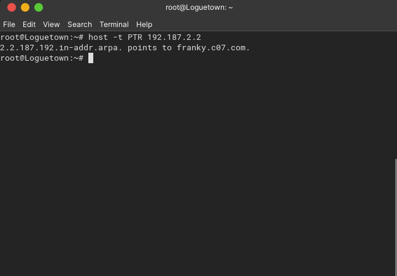
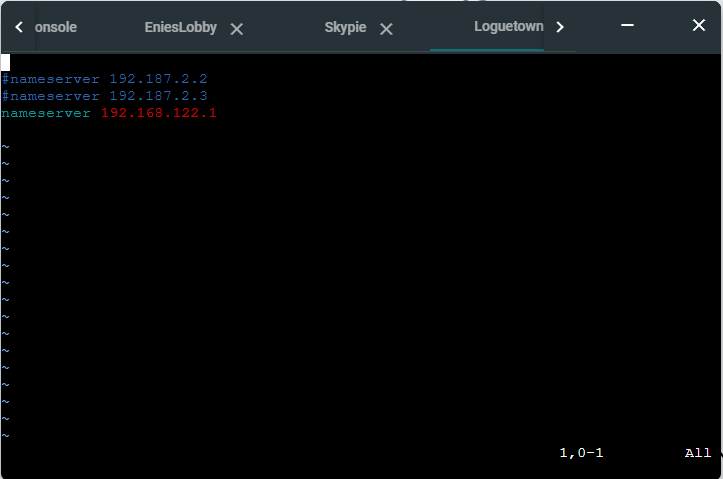
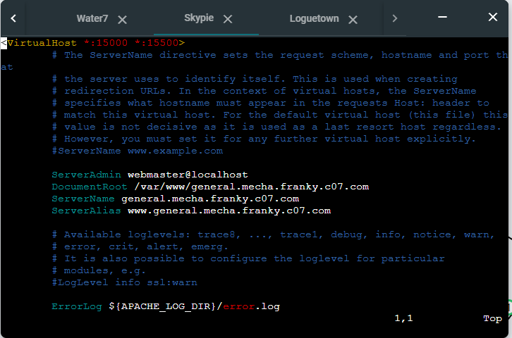

# Jarkom-Modul-2-C07-2021

Kelompok C07

|      NRP       |                  Nama                   |
| :------------: | :-------------------------------------: |
| 05111940000046 |       Titian Pamungkas Anjasmara        |
| 05111940000134 |           Ahmad Lamaul Farid            |
| 05111940000150 | Jonathan Leonardo Hasiholan Simanjuntak |

## Soal 1

```
EniesLobby akan dijadikan sebagai DNS Master, Water7 akan dijadikan DNS Slave, dan Skypie akan digunakan sebagai Web Server. Terdapat 2 Client yaitu Loguetown, dan Alabasta. Semua node terhubung pada router Foosha, sehingga dapat mengakses internet.
```

### Jawaban

Berikut adalah topology yang kami buat :


Kemudian buka `Edit network configuration` dan setting network pada masing-masing node.

**Foosha (sebagai Router)**


**Loguetown (sebagai Client)**


**Alabasta (sebagai Client)**


**EniesLobby (sebagai DNS Master)**


**Water7 (sebagai DNS Slave)**


**Skypie (sebagai Web Server)**


Setelah itu kami masukkan command `iptables -t nat -A POSTROUTING -o eth0 -j MASQUERADE -s 192.187.0.0/16` pada router `Foosha`.

Ketikkan `echo nameserver 192.168.122.1 > /etc/resolv.conf` pada node ubuntu yang lain.

Kemudian untuk mengecek apakah client dapat terkoneksi ke internet, ketikkan `ping google.com` pada salah satu node ubuntu. Disini kami menggunakan node `Loguetown`.


## Soal 2

```
Luffy ingin menghubungi Franky yang berada di EniesLobby dengan denden mushi. Kalian diminta Luffy untuk membuat website utama dengan mengakses franky.yyy.com dengan alias www.franky.yyy.com pada folder kaizoku
```

### Jawaban

**EniesLobby**

- Install bind9 menggunakan command `apt-get update` dan `apt-get install bind9 -y`
- Ubah isi file `/etc/bind/named.conf.local` menjadi sebagai berikut.


- Buat dir baru bernama kaizoku dengan cara `mkdir /etc/bind/kaizoku`
- Jalankan command `cp /etc/bind/db.local /etc/bind/kaizoku/franky.c07.com`
- Ubah isi file `/etc/bind/kaizoku/franky.c07.com` menjadi berikut.


- Restart bind9 dengan cara `service bind9 restart`

**Loguetown**

- Ubah isi file `/etc/resolv.conf` menjadi `nameserver 192.187.2.2`
- Jalankan ping `franky.c07.com`, akan berjalan seperti berikut.


### Jawaban

## Soal 3

```

```

### Jawaban

## Soal 4

```
Buat juga reverse domain untuk domain utama.
```

### Jawaban

**EniesLobby**

- Edit file `/etc/bind/named.conf.local` seperti pada gambar berikut:

  

- Ketikkan `cp /etc/bind/db.local /etc/bind/kaizoku/2.187.192.in-addr.arpa` untuk meng-copy isi dari `db.local` kedalam `2.187.192.in-addr.arpa`

- Edit file `/etc/bind/kaizoku/2.187.192.in-addr.arpa` seperti pada gambar berikut:

  

- Restart bind9 dengan perintah `service bind9 restart`

**Loguetown**

- Install `dnsutils` terlebih dahulu dengan command `apt-get install dnsutils -y`
- Ketikkan `host -t PTR 192.187.2.2` untuk mengecek konfigurasi

  

## Soal 5

```

```

### Jawaban

## Soal 6

```
Setelah itu terdapat subdomain mecha.franky.yyy.com dengan alias www.mecha.franky.yyy.com yang didelegasikan dari EniesLobby ke Water7 dengan IP menuju ke Skypie dalam folder sunnygo.
```

### Jawaban

**EniesLobby**

- Edit file `/etc/bind/kaizoku/franky.c07.com` seperti pada gambar berikut:

  

- Edit file `/etc/bind/named.conf.options` seperti pada gambar berikut:

  

- Edit file `/etc/bind/named.conf.local` seperti pada gambar berikut:

  

- Restart bind9 dengan perintah `service bind9 restart`

**Water7**

- Edit file `/etc/bind/named.conf.options` seperti pada gambar berikut:

  

- Edit file `/etc/bind/named.conf.local` seperti pada gambar berikut:

  

- Ketikkan `mkdir /etc/bind/sunnygo` untuk membuat folder `sunnygo` di dalam `/etc/bind`

- Ketikkan `cp /etc/bind/db.local /etc/bind/sunnygo/mecha.franky.c07.com` untuk meng-copy isi dari `db.local` kedalam `mecha.franky.c07.com`

- Edit file `/etc/bind/sunnygo/mecha.franky.c07.com` seperti pada gambar berikut:

  

- Restart bind9 dengan perintah `service bind9 restart`

**Loguetown**

- Lakukan ping domain `mecha.franky.c07.com` dan alias `www.mecha.franky.c07.com`

  

## Soal 7

```
Untuk memperlancar komunikasi Luffy dan rekannya, dibuatkan subdomain melalui Water7 dengan nama `general.mecha.franky.yyy.com` dengan alias `www.general.mecha.franky.yyy.com` yang mengarah ke Skypie.
```

### Jawaban

**Water7**

- Edit file `/etc/bind/sunnygo/mecha.franky.c07.com` seperti pada gambar berikut:

  

- Restart bind9 dengan perintah `service bind9 restart`

**Loguetown**

- Lakukan ping domain `general.mecha.franky.c07.com` dan alias `www.general.mecha.franky.c07.com`

  

## Soal 8

```
Setelah melakukan konfigurasi server, maka dilakukan konfigurasi Webserver. Pertama dengan webserver www.franky.yyy.com. Pertama, luffy membutuhkan webserver dengan DocumentRoot pada /var/www/franky.yyy.com.
```

### Jawaban

**EniesLobby**

- Edit file `/etc/bind/kaizoku/franky.c07.com` seperti pada gambar berikut:

  

- Restart bind9 dengan perintah

  ```
  service bind9 restart
  ```

**Skypie**

- Pertama - tama, update library dari ubuntu dengan perintah `apt-get update`.

- Install `apache2 dan librarynya` dengan memasukkan perintah `apt-get install apache2 -y` dan `apt-get install libapache2-mod-php7.0 -y`.

- Jalankan apache yang telah dipasang dengan memasukkan perintah `service apache2 start`.

- Install `php` dengan memasukkan perintah `apt-get install php -y`.

- Install tools `wget` dengan memasukkan perintah `apt-get install wget -y`.

- Install tools `unzip` dengan memasukkan perintah `apt-get install unzip -y`.

- Setelah semua tools sudah berhasil dipasang, download terlebih dahulu file library web yang telah disediakan dengan perintah :

  ```
  wget https://raw.githubusercontent.com/FeinardSlim/Praktikum-Modul-2-Jarkom/main/franky.zip
  ```

- Copy konfigurasi 000-default web server yang akan digunakan sebagai template konfigurasi web server franky.c07.com dengan perintah :

  ```
  cp /etc/apache2/sites-available/000-default.conf /etc/apache2/sites-available/franky.c07.com.conf
  ```

- Edit file `/etc/apache2/sites-available/franky.c07.com.conf` seperti pada gambar berikut :

  

- Buat folder `franky.c07.com` di direktori `/var/www/` dengan perintah :

  ```
  mkdir /var/www/franky.c07.com
  ```

- Unzip file library web yang sebelumnya telah di download ke folder yang telah dibuat dengan perintah :

  ```
  unzip -j franky.zip -d /var/www/franky.c07.com
  ```

- Jalankan konfigurasi website yang telah dibuat dengan menjalankan perintah :

  ```
  cd /etc/apache2/sites-available/
  a2ensite franky.c07.com.conf
  ```

- Restart service apache dengan perintah :

  ```
  service apache2 restart
  ```

**Loguetown**

- Pertama - tama, update library dari ubuntu dengan perintah `apt-get update`.

- Edit file `/etc/resolv.conf` menjadi seperti gambar berikut :

  

- Install `lynx` dengan memasukkan perintah `apt-get installlynx -y`.

- Edit file `/etc/resolv.conf` menjadi seperti gambar berikut :

  

- Masukkan perintah `lynx franky.c07.com` atau `lynx www.franky.c07.com`, hasilnya :

  

## Soal 9

```
Setelah itu, Luffy juga membutuhkan agar url www.franky.yyy.com/index.php/home dapat menjadi menjadi www.franky.yyy.com/home.
```

### Jawaban

**Skypie**

- Aktifkan fitur konfigurasi modul pada service `apache2` dengan menjalankan perintah :

  ```
  a2enmod rewrite
  ```

- Restart service apache dengan perintah :

  ```
  service apache2 restart
  ```

- Edit file `/var/www/franky.c07.com/.htaccess` menjadi seperti gambar berikut :

  

- Edit file `/etc/apache2/sites-available/franky.c07.com.conf` menjadi seperti gambar berikut :

  

- Restart service apache dengan perintah :

  ```
  service apache2 restart
  ```

**Loguetown**

- Buka alamat `www.franky.c07.com/home` dengan memasukkan perintah :

  ```
  lynx www.franky.c07.com/home
  ```

- Maka akan muncul tampilan halaman `www.franky.c07.com/home` seperti gambar berikut :

  

## Soal 10

```
Setelah itu, pada subdomain `www.super.franky.yyy.com`, Luffy membutuhkan penyimpanan aset yang memiliki DocumentRoot pada `/var/www/super.franky.yyy.com`.
```

### Jawaban

- Ketikkan `cp /etc/apache2/sites-available/000-default.conf /etc/apache2/sites-available/super.franky.c07.com.conf` untuk meng-copy isi dari `000-default.conf` kedalam `super.franky.c07.com.conf`

- Edit file `super.franky.c07.com.conf` seperti pada gambar berikut :

  

- Aktifkan konfigurasi `super.franky.c07.com`.

  ```
  a2ensite super.franky.c07.com
  ```

- Restart apache.

  ```
  service apache2 restart
  ```

- Download file zip yang sudah disediakan pada soal dengan menggunakan command

  ```
  wget https://raw.githubusercontent.com/FeinardSlim/Praktikum-Modul-2-Jarkom/main/super.franky.zip
  ```

- Kemudian unzip file yang telah didownload dan letakkan pada directory `/var/www/`. Setelah itu rename file menjadi `super.franky.c07.com` dengan command berikut :

  ```
  unzip super.franky.zip -d /var/www/
  mv /var/www/super.franky /var/www/super.franky.c07.com
  ```

- Kemudian buka direktory tempat kita meletakkan file yang telah di-unzip, maka akan muncul seperti pada gambar berikut :

  

**Loguetown**

- Buka `super.franky.c07.com` dengan command berikut :

  ```
  lynx super.franky.c07.com
  ```

- Setelah itu maka akan muncul seperti pada gambar berikut :

  

## Soal 11

```
Akan tetapi, pada folder `/public`, Luffy ingin hanya dapat melakukan directory listing saja.
```

### Jawaban

**Skypie**

- Edit file `/etc/apache2/sites-available/super.franky.c07.com.conf` seperti pada gambar berikut :

  

- Restart apache.

  ```
  service apache2 restart
  ```

**Loguetown**

- Buka `super.franky.c07.com/public` dengan command berikut :

  ```
  lynx super.franky.c07.com/public
  ```

- Setelah itu maka akan muncul seperti pada gambar berikut :

  

## Soal 12

```
Tidak hanya itu, Luffy juga menyiapkan error file 404.html pada folder /error untuk mengganti error kode pada apache .
```

### Jawaban

**Skypie**

- Edit file `/etc/apache2/sites-available/super.franky.c07.com.conf` menjadi seperti gambar berikut :

  

- Restart service apache dengan perintah :

  ```
  service apache2 restart
  ```

**Loguetown**

- Lakukan testing dengan memasukkan perintah :

  ```
  lynx super.franky.c07.com/publiccccccc
  ```

- Maka akan muncul tampilan seperti berikut :

  

## Soal 13

```
Luffy juga meminta Nami untuk dibuatkan konfigurasi virtual host. Virtual host ini bertujuan untuk dapat mengakses file asset www.super.franky.yyy.com/public/js menjadi www.super.franky.yyy.com/js.
```

### Jawaban

**Skypie**

- Edit file `/etc/apache2/sites-available/super.franky.c07.com.conf` menjadi seperti pada gambar berikut :

  

- Restart service apache dengan perintah :

  ```
  service apache2 restart
  ```

**Loguetown**

- Lakukan testing dengan memasukkan perintah :

  ```
  lynx www.super.franky.c07.com/js
  ```

- Maka akan muncul tampilan seperti berikut :

  

## Soal 14

```
Dan Luffy meminta untuk web www.general.mecha.franky.yyy.com hanya bisa diakses dengan port 15000 dan port 15500
```

### Jawaban

**Skypie**

- Download terlebih dahulu file library web yang telah disediakan dengan perintah :

  ```
  wget https://raw.githubusercontent.com/FeinardSlim/Praktikum-Modul-2-Jarkom/main/general.mecha.franky.zip
  ```

- Edit file `/etc/apache2/ports.conf`menjadi seperti gambar berikut :

  

- Buat file `/etc/apache2/sites-available/general.mecha.franky.c07.com.conf` dengan memanfaatkan template dari `/etc/apache2/sites-available/000-default.conf`.

- Kemudian edit file `/etc/apache2/sites-available/general.mecha.franky.c07.com.conf` seperti pada gambar berikut :

  

- Buat folder `general.mecha.franky.c07.com` di direktori `/var/www/` dengan perintah :

  ```
  mkdir /var/www/general.mecha.franky.c07.com
  ```

- Unzip file library web yang sebelumnya telah di download ke folder yang telah dibuat dengan perintah :

  ```
  unzip -j general.mecha.franky.zip -d /var/www/general.mecha.franky.c07.com
  ```

- Jalankan konfigurasi website yang telah dibuat dengan menjalankan perintah :

  ```
  cd /etc/apache2/sites-available/
  a2ensite franky.c07.com.conf
  ```

- Restart service apache dengan perintah :

  ```
  service apache2 restart
  ```

- Kembali ke directory root dengan memasukkan perintah :

  ```
  cd
  ```

- Hapus file .zip yang telah di download sebelumnya dengan memasukkan perintah :

  ```
  rm -rf general.mecha.franky.zip
  ```

**Loguetown**

- Untuk menguji keberhasilan akses pada port 15000, masukkan perintah :

  ```
  lynx www.general.mecha.franky.c07.com:15000
  ```

- Maka akan muncul tampilan seperti pada gambar berikut :

  

- Sedangkan ntuk menguji keberhasilan akses pada port 15500, masukkan perintah :

  ```
  lynx www.general.mecha.franky.c07.com:15500
  ```

- Maka akan muncul tampilan seperti pada gambar berikut :

  

## Soal 15

```
dengan autentikasi username luffy dan password onepiece dan file di /var/www/general.mecha.franky.yyy
```

### Jawaban

**Skypie**

- Edit file `/etc/apache2/sites-available/general.mecha.franky.c07.com.conf` menjadi seperti gambar berikut :

  

- Buat file autentikasi yang diperlukan, sesuai dengan permintaan pada soal, dengan menggunakan perintah :

  ```
  htpasswd -cb /etc/apache2/.htpasswd luffy onepiece
  ```

- Restart service apache dengan perintah :

  ```
  service apache2 restart
  ```

**LogueTown**

- Untuk menguji konfigurasi yang telah dilakukan, masukkan perintah :

  ```
  lynx general.mecha.franky.c07.com:15000
  ```

  Atau,

  ```
  lynx general.mecha.franky.c07.com:15500
  ```

- Setelah halaman berhasil diakses, tunggu sejenak, maka akan muncul tampilan halaman seperti pada gambar. Di halaman ini, masukkan autentikasi username yang sebelumnya telah ditetapkan (luffy).

  

- Setelah itu, masukkan autentikasi password yang sebelumnya telah ditetapkan (onepiece).

  

- Jika autentikasi sudah benar, maka akan muncul tampilan seperti pada gambar :

  

## Soal 16

```

```

### Jawaban

## Soal 17

```

```

### Jawaban
