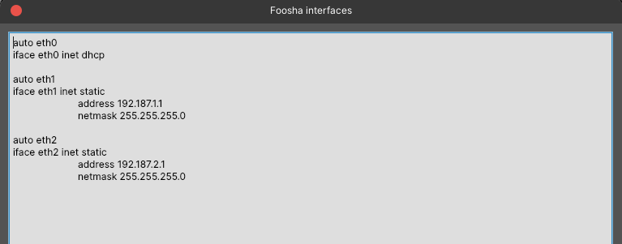

# Jarkom-Modul-2-C07-2021

Kelompok C07

|      NRP       |                  Nama                   |
| :------------: | :-------------------------------------: |
| 05111940000046 |       Titian Pamungkas Anjasmara        |
| 05111940000134 |           Ahmad Lamaul Farid            |
| 05111940000150 | Jonathan Leonardo Hasiholan Simanjuntak |

## Soal 1

```
EniesLobby akan dijadikan sebagai DNS Master, Water7 akan dijadikan DNS Slave, dan Skypie akan digunakan sebagai Web Server. Terdapat 2 Client yaitu Loguetown, dan Alabasta. Semua node terhubung pada router Foosha, sehingga dapat mengakses internet.
```

### Jawaban

Berikut adalah topology yang kami buat :


Kemudian buka `Edit network configuration` dan setting network pada masing-masing node.

**Foosha (sebagai Router)**



**Loguetown (sebagai Client)**


**Alabasta (sebagai Client)**


**EniesLobby (sebagai DNS Master)**


**Water7 (sebagai DNS Slave)**


**Skypie (sebagai Web Server)**


Setelah itu kami masukkan command `iptables -t nat -A POSTROUTING -o eth0 -j MASQUERADE -s 192.187.0.0/16` pada router `Foosha`.

Ketikkan `echo nameserver 192.168.122.1 > /etc/resolv.conf` pada node ubuntu yang lain.

Kemudian untuk mengecek apakah client dapat terkoneksi ke internet, ketikkan `ping google.com` pada salah satu node ubuntu. Disini kami menggunakan node `Loguetown`.


## Soal 2

```

```

### Jawaban

## Soal 3

```

```

### Jawaban

## Soal 4

```
Buat juga reverse domain untuk domain utama.
```

### Jawaban

**EniesLobby**

-   Edit file `/etc/bind/named.conf.local` seperti pada gambar berikut:

    

-   Ketikkan `cp /etc/bind/db.local /etc/bind/kaizoku/2.187.192.in-addr.arpa` untuk meng-copy isi dari `db.local` kedalam `2.187.192.in-addr.arpa`

-   Edit file `/etc/bind/kaizoku/2.187.192.in-addr.arpa` seperti pada gambar berikut:

    

-   Restart bind9 dengan perintah `service bind9 restart`

**Loguetown**

-   Install `dnsutils` terlebih dahulu dengan command `apt-get install dnsutils -y`
-   Ketikkan `host -t PTR 192.187.2.2` untuk mengecek konfigurasi

    

## Soal 5

```

```

### Jawaban

## Soal 6

```
Setelah itu terdapat subdomain mecha.franky.yyy.com dengan alias www.mecha.franky.yyy.com yang didelegasikan dari EniesLobby ke Water7 dengan IP menuju ke Skypie dalam folder sunnygo.
```

### Jawaban

**EniesLobby**

-   Edit file `/etc/bind/kaizoku/franky.c07.com` seperti pada gambar berikut:

    

-   Edit file `/etc/bind/named.conf.options` seperti pada gambar berikut:

    

-   Edit file `/etc/bind/named.conf.local` seperti pada gambar berikut:

    

-   Restart bind9 dengan perintah `service bind9 restart`

**Water7**

-   Edit file `/etc/bind/named.conf.options` seperti pada gambar berikut:

    

-   Edit file `/etc/bind/named.conf.local` seperti pada gambar berikut:

    

-   Ketikkan `mkdir /etc/bind/sunnygo` untuk membuat folder `sunnygo` di dalam `/etc/bind`

-   Ketikkan `cp /etc/bind/db.local /etc/bind/sunnygo/mecha.franky.c07.com` untuk meng-copy isi dari `db.local` kedalam `mecha.franky.c07.com`

-   Edit file `/etc/bind/sunnygo/mecha.franky.c07.com` seperti pada gambar berikut:

    

-   Restart bind9 dengan perintah `service bind9 restart`

**Loguetown**

-   Lakukan ping domain `mecha.franky.c07.com` dan alias `www.mecha.franky.c07.com`

    

## Soal 7

```
Untuk memperlancar komunikasi Luffy dan rekannya, dibuatkan subdomain melalui Water7 dengan nama `general.mecha.franky.yyy.com` dengan alias `www.general.mecha.franky.yyy.com` yang mengarah ke Skypie.
```

### Jawaban

**Water7**

-   Edit file `/etc/bind/sunnygo/mecha.franky.c07.com` seperti pada gambar berikut:

    

-   Restart bind9 dengan perintah `service bind9 restart`

**Loguetown**

-   Lakukan ping domain `general.mecha.franky.c07.com` dan alias `www.general.mecha.franky.c07.com`

    

## Soal 8

```

```

### Jawaban

## Soal 9

```

```

### Jawaban

## Soal 10

```
Setelah itu, pada subdomain `www.super.franky.yyy.com`, Luffy membutuhkan penyimpanan aset yang memiliki DocumentRoot pada `/var/www/super.franky.yyy.com`.
```

### Jawaban

-   Ketikkan `cp /etc/apache2/sites-available/000-default.conf /etc/apache2/sites-available/super.franky.c07.com.conf` untuk meng-copy isi dari `000-default.conf` kedalam `super.franky.c07.com.conf`

-   Edit file `super.franky.c07.com.conf` seperti pada gambar berikut :

    

-   Aktifkan konfigurasi `super.franky.c07.com`.

    ```
    a2ensite super.franky.c07.com
    ```

-   Restart apache.

    ```
    service apache2 restart
    ```

-   Download file zip yang sudah disediakan pada soal dengan menggunakan command

    ```
    wget https://raw.githubusercontent.com/FeinardSlim/Praktikum-Modul-2-Jarkom/main/super.franky.zip
    ```

-   Kemudian unzip file yang telah didownload dan letakkan pada directory `/var/www/`. Setelah itu rename file menjadi `super.franky.c07.com` dengan command berikut :

    ```
    unzip super.franky.zip -d /var/www/
    mv /var/www/super.franky /var/www/super.franky.c07.com
    ```

-   Kemudian buka direktory tempat kita meletakkan file yang telah di-unzip, maka akan muncul seperti pada gambar berikut :

    

**Loguetown**

-   Buka `super.franky.c07.com` dengan command berikut :

    ```
    lynx super.franky.c07.com
    ```

-   Setelah itu maka akan muncul seperti pada gambar berikut :

    

## Soal 11

```
Akan tetapi, pada folder `/public`, Luffy ingin hanya dapat melakukan directory listing saja.
```

### Jawaban

**Skypie**

-   Edit file `/etc/apache2/sites-available/super.franky.c07.com.conf` seperti pada gambar berikut :

    

-   Restart apache.

    ```
    service apache2 restart
    ```

**Loguetown**

-   Buka `super.franky.c07.com/public` dengan command berikut :

    ```
    lynx super.franky.c07.com/public
    ```

-   Setelah itu maka akan muncul seperti pada gambar berikut :

    

## Soal 12

```

```

### Jawaban

## Soal 13

```

```

### Jawaban

## Soal 14

```

```

### Jawaban

## Soal 15

```

```

### Jawaban

## Soal 16

```

```

### Jawaban

## Soal 17

```

```

### Jawaban
